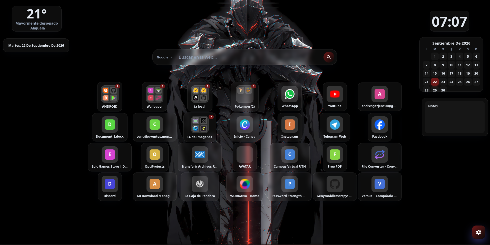

<div align="center">

# Novantab 2.0

**Nueva pestaña privada para tu navegador**

[](https://developer.chrome.com/docs/extensions/develop/migrate)
[]()
[]()
[](LICENSE)
[]()
[]()

Reemplaza la página de "Nueva pestaña" por una interfaz **moderna, rápida y 100 % privada**:
búsqueda, favoritos, carpetas, widgets y personalización completa. Todo se guarda
en `storage.local` de tu navegador — sin servidores, sin analítica, sin tracking.

</div>

---

## ✨ Características

- 🔍 **Barra de búsqueda** con motor configurable: Google, Bing, DuckDuckGo,
  Brave Search, Ecosia o **motor personalizado** (`{query}` de plantilla).
- 📌 **Cuadrícula de favoritos**: añadir, editar, eliminar, reordenar,
  arrastrar y soltar, con icono personalizado.
- 📁 **Carpetas**: crear, renombrar, eliminar; mover sitios dentro, fuera y
  entre carpetas; abrir su contenido en un modal.
- ⏱️ **Widgets**: reloj (12/24 h con AM/PM), fecha y clima. Posición libre
  (arrastrar donde quieras) y **redimensionado manual** de esquina, estilo Android.
- 🖱️ **Drag & Drop** fluido con indicador visual de destino.
- 🎨 **Personalización**: tema (claro/oscuro/auto), fondo (color, gradiente,
  imagen local o por URL), transparencia, desenfoque, radio, tamaño de iconos,
  número de columnas, mostrar/ocultar nombres y favicons.
- 🔒 **100 % local**: los datos viven en `storage.local`. Sin analítica, sin
  tracking, sin historial, sin servidores.
- 💾 **Importar/Exportar** la configuración en JSON (con validación).
- ⌨️ **Accesible y con atajos**: navegación por teclado, ARIA, focus visible,
  `Ctrl+K`, `Ctrl+Shift+A`, `Ctrl+Shift+F`, `Escape`.

---

## 🤝 Contribuir

¿Quieres mejorar Novantab o descargarlo para usarlo? Todo lo que necesitas está
en el repo:

- 💾 **Descargar**: clona el repo (`git clone`) o descarga el `.zip` de la
  última **Release** (lista para cargar en `chrome://extensions` como
  descomprimida).
- 🧑‍💻 **Mejorar**: lee [CONTRIBUTING.md](CONTRIBUTING.md) antes de tocar código.
  Hay plantillas para [reportar bugs](.github/ISSUE_TEMPLATE/bug_report.md),
  [pedir funciones](.github/ISSUE_TEMPLATE/feature_request.md) y
  [enviar pull requests](.github/PULL_REQUEST_TEMPLATE.md).
- ✅ **CI**: tests + build de Chrome se ejecutan automáticamente en cada push y
  PR (`.github/workflows/ci.yml`). Los tags `v*` generan una **Release** con el
  `.zip` incluido (`release.yml`).

## 🤖 ¿Cómo se ve?



Abre una nueva pestaña y listo. La extensión sobrescribe la página de "Nueva
pestaña" de forma nativa (`chrome_url_overrides.newtab`), así que no necesitas
pinchar en ningún botón: cada pestaña nueva ya es **Novantab**.

---

## 📦 Instalación (versión compilada)

El repo incluye el build listo para instalar en `dist/chrome/`.

### Chrome / Chromium / Brave / Edge / Quetta

1. Abre `chrome://extensions`.
2. Activa el **modo desarrollador** (interruptor arriba a la derecha).
3. Pulsa **"Cargar descomprimida"**.
4. Selecciona la carpeta `dist/chrome/`.
5. Abre una **nueva pestaña** para ver la extensión.

> En Android con **Quetta**: activa "Permitir extensiones" y carga la carpeta
> (o un `.zip` de `dist/chrome/`) desde los Ajustes de extensiones.

---

## 🔨 Build desde el código

Requisitos: **Node.js ≥ 18**. Sin dependencias externas (script propio).

```bash
npm run icons          # regenera los iconos PNG (opcional)
npm run build          # genera dist/chrome
npm test               # ejecuta los tests (URLs e import/export)
```

Salida:

```
dist/
└── chrome/   → carga descomprimida en chrome://extensions
```

---

## 🗂️ Estructura

```
browser-newtab/
├── src/
│   ├── background/          # script de fondo mínimo (sin banners/logs)
│   ├── components/          # search-bar, grid, modal, context-menu, settings…
│   ├── main/                # bootstrap, index (orquestador), forms, openers
│   ├── pages/newtab/        # newtab.html + main.css
│   ├── services/            # bookmarks, folders, settings, widgets, favicon…
│   ├── storage/             # browser-api (wrapper) + store (persistencia)
│   ├── styles/              # variables, base, components (temas CSS)
│   └── utils/               # id, url, dom
├── public/icons/            # iconos generados (script propio, sin deps)
├── tests/                   # node --test
├── scripts/                 # build.mjs, icons.mjs
├── dist/                    # salida lista para instalar (Chrome)
├── manifest.chrome.json
└── package.json
```

### Capa multiplataforma

El wrapper `src/storage/browser-api.js` detecta `browser.*` o `chrome.*` y
normaliza `storage.local` a Promesas, de modo que toda la app usa
`browserAPI.storage.get/set`. Funciona en Chrome, Chromium, Brave, Edge y Quetta.

---

## 🔐 Privacidad

- Todos los favoritos, carpetas, widgets y ajustes se guardan en `storage.local`.
- No se envía nada a servidores externos (salvo lo que el usuario pida: el
  favicon del propio sitio y la búsqueda/web que se realice).
- El widget de clima está **deshabilitado por defecto**.
- Sin analítica, sin publicidad, sin recopilación de historial.

## ⌨️ Atajos de teclado

| Atajo             | Acción            |
| ----------------- | ----------------- |
| `Ctrl+K` / `Cmd+K`| Enfocar búsqueda  |
| `Ctrl+Shift+A`    | Añadir sitio      |
| `Ctrl+Shift+F`    | Crear carpeta     |
| `Escape`          | Cerrar modal/menú |

---

## ✅ Compatibilidad

- **Chrome/Chromium**: Manifest V3, `chrome_url_overrides.newtab`.
- **Brave / Edge / Quetta (Chromium)**: también compatibles.

## 📄 Licencia

[MIT](LICENSE). Hecho para un uso totalmente local y con respeto a la privacidad.

> Estética de referencia de la UI: [uiverse.io/elements](https://uiverse.io/elements).